<p align="center">
  
</p>

<h1 align="center">DAVEMANUJ</h1>
<p align="center"><strong>Backend Engineer • Systems Builder • Game Developer</strong></p>

<p align="center">
  
  
  
  
</p>

<p align="center">
  
</p>

<p align="center">
  
  
  
  
  
  
</p>

```text
+----------------------------------------------------------+
| PLAYER PROFILE                                           |
+----------------------------------------------------------+
| NAME    :: DAVEMANUJ                                     |
| CLASS   :: Backend Engineer / Systems Builder / Game Dev |
| STYLE   :: Quiet precision + clean execution             |
| FOCUS   :: APIs / systems / game feel / practical tools  |
| MISSION :: Build things that stay sharp under load       |
+----------------------------------------------------------+
```

## About

I like systems that stay sharp under load and products that still feel alive.

That usually means:

- backend systems with structure, reliability, and clean contracts
- tools that solve real problems instead of demoing hype
- game-dev work with pacing, feedback, and system clarity
- interfaces that support the system instead of masking it

## Main Quests

### TypeStrike
Typing arcade shooter built in Unity with escalating pace, score pressure, and satisfying combat rhythm.

### AniCast
Animated Android weather companion where character behavior shifts with live weather conditions.

### SkillGenome
AI-powered skill analysis and roadmap builder that turns resumes and GitHub data into structured growth paths.

### SwiftStudy
Gamified study app designed around momentum, fast loops, and repeatable progression.

## Loadout

### Backend and Tools

<p>
  
  
  
  
  
  
</p>

### Game Dev

<p>
  
  
  
  
  
</p>

### Interface Systems

<p>
  
  
  
  
  
  
</p>

### AI and Data

<p>
  
  
  
  
  
</p>

## Dev Philosophy

```text
> design the system first
> keep contracts clean
> make failure states visible
> build for clarity under pressure
> ship work that feels sharp
```

## Status Screen

<p align="center">
  
  
</p>

## Connect

- GitHub: https://github.com/DAVEMANUJ
- Repositories: https://github.com/DAVEMANUJ?tab=repositories

---

<p align="center"><strong>Build things that feel alive.</strong></p>
