<p align="center">
  
</p>

<h1 align="center">DAVEMANUJ</h1>
<p align="center"><strong>Indie Game Developer • Frontend Engineer • Systems Builder</strong></p>

<p align="center">
  
  
  
  
</p>

```text
╔════════════════════════════════════════════════════════════╗
║ PLAYER PROFILE                                             ║
╠════════════════════════════════════════════════════════════╣
║ NAME      :: DAVEMANUJ                                     ║
║ CLASS     :: Indie Builder / Game Dev / Frontend Engineer  ║
║ STYLE     :: Arcade energy + clean execution               ║
║ SPECIAL   :: Game feel / motion UI / practical systems     ║
║ MISSION   :: Build things that look alive and play well    ║
╚════════════════════════════════════════════════════════════╝
```

## About

I like products that move with intent.

That usually means:

- gameplay logic with rhythm and clarity
- frontend work with motion, contrast, and personality
- tools that solve real problems instead of demoing hype
- software that borrows pacing and feedback from games

## Main Quests

### TypeStrike
Typing arcade shooter built in Unity with escalating pace, score pressure, and satisfying combat rhythm.

### AniCast
Animated Android weather companion where character behavior shifts with live weather conditions.

### SkillGenome
AI-powered skill analysis and roadmap builder that turns resumes and GitHub data into structured growth paths.

### SwiftStudy
Gamified study app designed around momentum, fast loops, and repeatable progression.

## Loadout

### Game Dev
- Unity 6
- C#
- TextMeshPro
- Gameplay scripting
- UI and interaction tuning

### Frontend
- HTML
- CSS
- JavaScript
- React
- TypeScript
- Animation-heavy interface work

### Backend and Tools
- Python
- Flask
- Node
- SQLite
- Java
- PowerShell

### AI and Data
- spaCy
- KeyBERT
- Sentence Transformers
- Document parsing workflows
- Recommendation and roadmap generation

## Dev Philosophy

```text
> prototype fast
> polish hard
> keep systems readable
> make feedback immediate
> ship useful work with style
```

## Status Screen

<p align="center">
  
  
</p>

## Connect

- GitHub: https://github.com/DAVEMANUJ
- Repositories: https://github.com/DAVEMANUJ?tab=repositories

---

<p align="center"><strong>Build things that feel alive.</strong></p>
